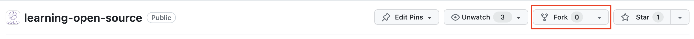
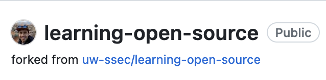
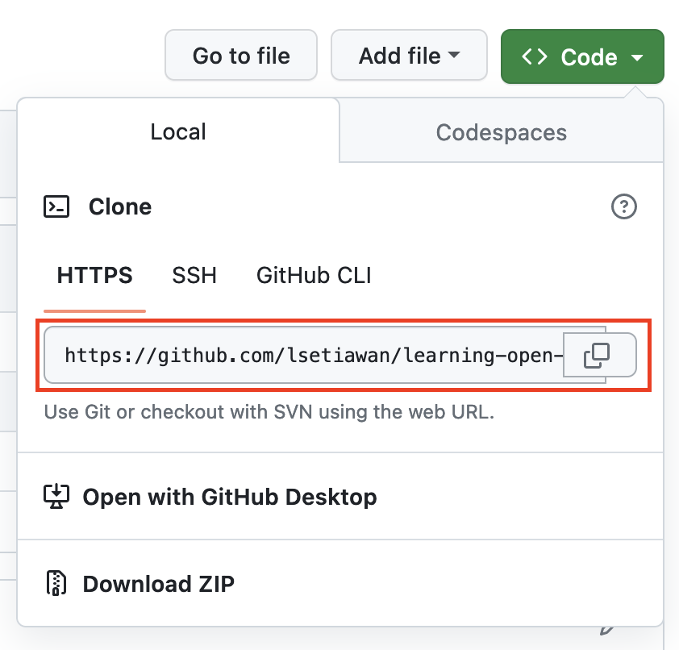
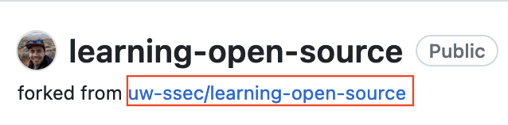
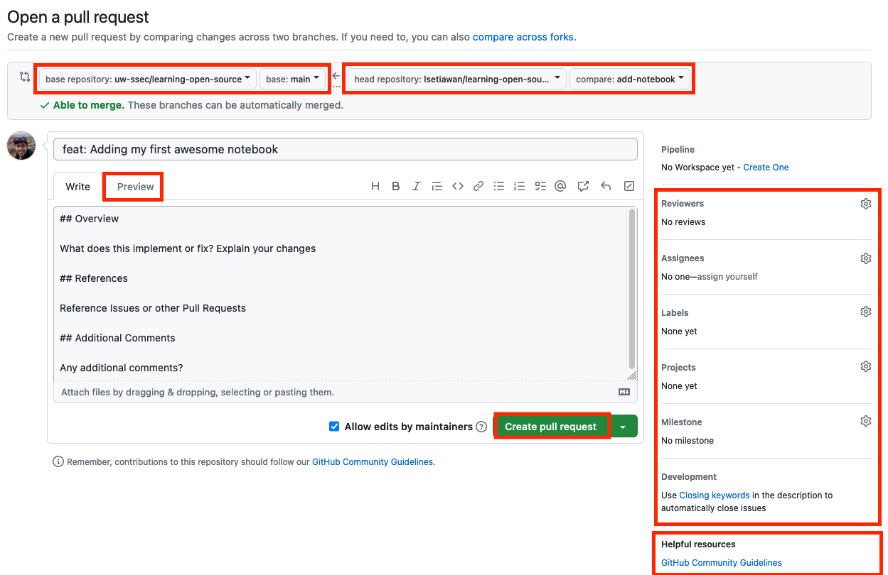
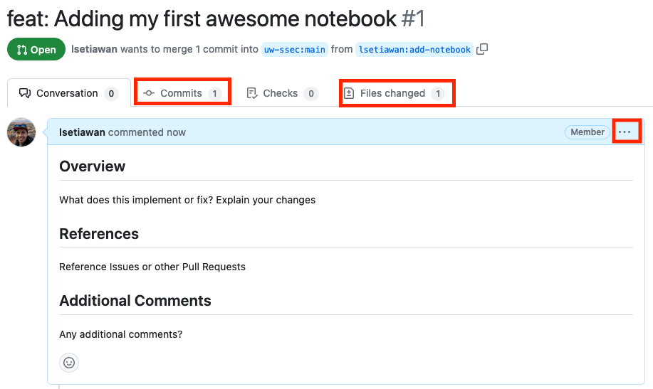

# Git and Github for collaboration

Collaboration is the lifeblood of modern software development. Whether you're building a web application, contributing to an open-source project, or working on a team project, efficient collaboration is key to success. You've seen in the previous tutorial that using Conda and Jupyter Notebook would allow for an efficient exchange of ideas and reproducibility.

In this tutorial, we'll explore the dynamic duo of Git and GitHub, two powerful tools that have revolutionized the way developers collaborate, manage code, and track changes. We'll delve into what Git and GitHub are, how they work, and how they can simplify and streamline collaborative coding.

## Git: The Foundation of Collaborative Coding

Git is a distributed version control system that was created by Linus Torvalds, the same genius behind Linux. It's designed to help developers manage and track changes to their code or documents, collaborate with others, and work seamlessly across different machines.

**Key features**:

- **Version Control**: Git allows you to track changes to your code over time, helping you understand what has been done, when it was done, and who did it.
- **Branching**: With Git, you can create branches to work on new features or bug fixes independently, keeping your main codebase clean and stable.
- **Merging**: Merging code from multiple branches is straightforward in Git, enabling smooth collaboration between team members.
- **Local and Remote Repositories**: Git supports local repositories for offline work and remote repositories for collaboration. This makes it versatile and accessible for developers in various scenarios.

There are a lot of resources out there to learn about how to use git, we recommend going through [Software Carpentry, Version Control with Git](https://swcarpentry.github.io/git-novice/).

## GitHub: The Collaborative Hub

[GitHub](https://github.com) is a web-based platform that hosts Git repositories, providing a central hub for collaboration and code management. It adds a layer of social interaction, project management, and collaboration tools on top of Git.

**Key features**:

- **Remote Hosting**: GitHub stores your Git repositories in the cloud, making them accessible from anywhere with an internet connection.
- **Pull Requests**: Developers can propose changes to a project through pull requests. This is a powerful way to review, discuss, and contribute to code improvements collaboratively.
- **Issue Tracking**: GitHub includes a built-in issue tracking system, allowing teams to manage tasks, bugs, and enhancements efficiently.
- **Documentation and Wikis**: You can create detailed documentation and wikis for your projects, making it easier for contributors to understand and work on your code.
- **Discussions**: You can host a forum based discussions within Github to track engagement for your project.
- **Codespaces**: A cloud-hosted development environments for software developers offered by Github. It allows developers to write, build, and test code directly within their web browser, making it easier to collaborate and work on projects from different devices and locations.

## Open Source Development with Git and GitHub

Git and GitHub work seamlessly together, creating an environment where developers can collaborate efficiently and manage code effectively. This allows ease of development and collaboration, which contributes to the success of many open source projects. Here's how:

- **Version Control with Git**: Git handles version control and local development, while GitHub serves as the remote hub for project sharing and collaboration.
- **Pull Requests**: GitHub's pull request feature allows developers to propose changes, review code, and have discussions, making it easy to manage contributions from multiple team members.
- **Forking and Cloning**: Developers can fork a project (create a personal copy) and clone it to their local environment, work on it, and propose changes back to the original project through pull requests.
- **Team Collaboration**: GitHub makes it easy for teams to work together, manage issues, and coordinate their work in a centralized location.

### Github Collaboration Step by step

Now that we've outlined the key features and values of Git and Github, let's walk through step by step on what this looks like with the previous knowledge of conda and jupyter notebook.

For your convenience we've set up a github repository where you can practice by contributing to it called [learning-open-source](https://github.com/uw-ssec/learning-open-source).

**NOTE: All code contribution should go into the `contributions` directory in that repository,
and underneath your own named directory.
For simplicity we suggest naming your directory the same way as your github username**

These steps follow a [Git Forking Workflow](https://www.atlassian.com/git/tutorials/comparing-workflows/forking-workflow).

#### Step 1: Sign into GitHub

Sign into your GitHub account, or [create a free GitHub account](https://github.com/join) if you don't have one.

#### Step 2: Fork the project repository

Go to the `learning-open-source` repository at [https://github.com/uw-ssec/learning-open-source](https://github.com/uw-ssec/learning-open-source), and then "fork" it by clicking the Fork button in the upper right corner:



When prompted to Create a new fork, just press the **Green Create fork button**. This creates a copy of the project repository in your GitHub account. In the upper left corner, you will see that you are now looking at a repository in your account:



#### Step 3: Clone your fork

While still in your repository, click the green `<> Code` button and then copy the HTTPS URL in the Local tab:



Using Git on your local machine, clone your fork using the URL you just copied: `git clone URL_OF_FORK`.

For example, we used:

```console
git clone https://github.com/lsetiawan/learning-open-source.git
```

Cloning copies the repository files (and commit history) from GitHub to your local machine. The repository will be downloaded into a subdirectory of your working directory, and the subdirectory will have the same name as the repository.

#### Step 4: Navigate to your local repository

Since the clone was downloaded into a subdirectory of your working directory, you can navigate to it using:

```console
cd learning-open-source
```

#### Step 5: Check that your fork is the "origin" remote

You are going to be synchronizing your local repository with both the project repository (on GitHub) and your fork (also on GitHub).

The URLs that point to these repositories are called **"remotes"**.
More specifically, the project repository is called the `upstream` remote, and your fork is called the `origin` remote.

When you cloned your fork, that should have automatically set your fork as the `origin` remote.

You can get the current remotes:

```console
git remote -v
```

You should see the URL of your fork (which you copied in step 3) next to the word `origin`.

If you don't see an `origin` remote, you can add it using: `git remote add origin URL_OF_FORK`.

#### Step 6: Add the project repository as the "upstream" remote

Go to your fork on GitHub, and click the "forked from" link to return to the project repository:



While in the project repository, click the green `<> Code` button and then copy the HTTPS URL in the Local tab similar to step 3 above.

Add the project repository as the "upstream" remote using: `git remote add upstream URL_OF_PROJECT`.

For example, we used:

```console
git remote add upstream https://github.com/uw-ssec/learning-open-source.git
```

Use `git remote -v` again to check that you now have two remotes: an `origin` that points to your fork, and an `upstream` that points to the project repository.

```console
# Example below shows the terminal print out
% git remote -v
origin	https://github.com/lsetiawan/learning-open-source.git (fetch)
origin	https://github.com/lsetiawan/learning-open-source.git (push)
upstream	https://github.com/uw-ssec/learning-open-source.git (fetch)
upstream	https://github.com/uw-ssec/learning-open-source.git (push)
```
This diagram summarizes the entire setup process (steps 1 through 6):


#### Step 7: Pull the latest changes from upstream into your local repository

Before you start making any changes to your local files, it's a good practice to first synchronize your local repository with the project repository.
Use `git pull upstream main` to "pull" any changes from the `main` branch of the `upstream` into your local repository.

If you forked and cloned the project repository just a few minutes ago, it's very unlikely there will be any changes, in which case Git will report that your local repository is "already up to date".
But if there are any changes, they will automatically be merged into your local repository.

#### Step 8: Create a new branch

Rather than making changes to the project's `main` branch, it's a good practice to instead create your own branch. This creates an environment for your work that is isolated from the `main` branch.

Use `git checkout -b BRANCH_NAME` to create a new branch and then immediately switch to it.

*The name of the branch should briefly describe what you are working on, and should not contain any spaces.*

For example, we will create a new branch name called `add-notebook` to describe that we will be adding a jupyter notebook:

```console
git checkout -b add-notebook
```

Use `git branch` to show your local branches. You should see your new branch as well as "main", and your new branch should have an asterisk next to it to indicate that it's "checked out" (meaning that you're working in it).

```console
# Example below shows the terminal print out
% git branch
* add-notebook
  main
```

#### Step 9: Make changes in your local repository

Now we're ready to add the notebook and conda environment that we created earlier so we can share with everyone on github!

**Note: The below instructions are to be run in a command line, however you can also use your file explorer applications for your operating system to create new folders and move files**

First create the proper directory where your jupyter notebook and conda environment yaml file will go into:

```console
# Go into the contributions directory
cd contributions

# Make new directory with your github username as the directory name
mkdir lsetiawan
```

Move the jupyter notebook and conda environment yaml file into the new directory that you've just created.

```console
# Move the jupyter notebook
mv /path/to/my-first-notebook.ipynb ./lsetiawan/my-first-notebook.ipynb

# Move the yaml file
mv /path/to/environment.yml ./lsetiawan/environment.yml
```

#### Step 10: Commit your changes

Once you've moved the files to the proper directory, now let's commit our set of changes to git.

Use `git add -A` to stage your changes and `git commit -m "DESCRIPTION OF CHANGES"` to commit them.

Here are the typical steps:

1. Stage changes

    ```console
    git add -A
    ```

2. Double check change status, this serves as a nice self review to make sure that you haven't accidentally committed additional files that you might not want to commit.

    ```console
    git status
    ```

3. Now we commit changes!

    ```console
    git commit -m "feat: Added my first jupyter notebook and yaml file"
    ```

**If you are making multiple sets of changes, it's a good practice to make a commit after each set.**

#### Step 11: Push your changes to your fork

When you are done making all of your changes, upload these changes to your fork using `git push origin BRANCH_NAME`. This "pushes" your changes to the "BRANCH_NAME" branch of the "origin" (which is your fork on GitHub).

```console
# Push to your fork, add-notebook branch
git push origin add-notebook
```

#### Step 12: Begin the pull request

When you execute step 11, you'd probably get something like below from git:

```console
Enumerating objects: 6, done.
Counting objects: 100% (6/6), done.
Delta compression using up to 10 threads
Compressing objects: 100% (4/4), done.
Writing objects: 100% (4/4), 999 bytes | 999.00 KiB/s, done.
Total 4 (delta 1), reused 0 (delta 0), pack-reused 0
remote: Resolving deltas: 100% (1/1), completed with 1 local object.
remote:
remote: Create a pull request for 'add-notebook' on GitHub by visiting:
remote:      https://github.com/lsetiawan/learning-open-source/pull/new/add-notebook
remote:
To https://github.com/lsetiawan/learning-open-source.git
 * [new branch]      add-notebook -> add-notebook
```

Git is really good at giving feedback instructions after a command.
We highly recommend reading through what it says and following so if you desire.
In this case, it has given a url to **open a pull request** and described that a new branch has
been created in your fork.

To open a pull request, simply go to the given url. In this case: `https://github.com/lsetiawan/learning-open-source/pull/new/add-notebook`.

#### Step 13: Create the pull request

When opening a "pull request", you are making a "request" that the project repository "pull" changes from your fork. You will see that the project repository is listed as the **"base repository"**, and your fork is listed as the **"head repository"**:



Before submitting the pull request, you first need to describe the changes you made (rather than asking the project maintainers to figure them out on their own). You should write a descriptive title for your pull request, and then include more details in the body of the pull request. If there are any related GitHub issues, make sure to mention those by number. The body can include Markdown formatting, and you can click the **"Preview"** tab to see how it will look.

On the right side, you may see the following:

- Various sections to assign. **If you are not part of the organization team or repository, you wouldn't have enough permission to assign these section. The maintainer will do it for you**:
  - Reviewers: People to review.
  - Assignees: Person that is assigned to work on this. Most times this is you.
  - Labels: Any labels associated to this pull request.
  - Projects: Github project associated to this pull request.
  - Milestone: Github milestone associated to this pull request.
  - Development: Github issues connected to this pull request. If you assign an issue here, once the pull request is merged, that issue will automatically be closed.
- Links to the project's Contributing or Community guidelines under **"Helpful resources"**. This is primarily worth reading through if you are submitting substantial code (rather than just fixing a typo), but it may still be worth scanning through at this point.

Below the pull request form, you will see a list of the commits you made in your branch, as well as the "diffs" for all of the files you changed.

If everything looks good, click the green Create pull request button!

This diagram summarizes the entire pull request process process (steps 7 through 13):


#### Step 14: Review the pull request

You have now created a pull request, which is stored in the project's repository (not in your fork of the repository). It's a good idea to read through what you wrote, as well as clicking on the **"Commits"** tab and the **"Files changed"** tab to review the contents of your pull request:



If you realize that you left out some important details, you can click the 3 dots in the upper right corner to edit your pull request description.

#### Step 15: Add more commits to your pull request

You can continue to add more commits to your pull request even after opening it! For example, the project maintainers may ask you to make some changes, or you may just think of a change that you forgot to include.

Start by returning to your local repository, and use `git branch` to see which branch is currently checked out. If you are currently in the `main` branch (rather than the branch you created), then use `git checkout BRANCH_NAME` to switch. 

```console
# Check out the add-notebook branch again
git checkout add-notebook
```

Then, you should **repeat steps 9 through 11**: make changes, commit them, and push them to your fork.

Finally, return to your open pull request on GitHub and refresh the page. You will see that your new commits have automatically been added to the pull request.

#### Step 16: Discuss the pull request

If there are questions or discussion about your pull request from the project maintainers, you can add to the conversation using the comment box at the bottom of the pull request:


If there are inline comments about specific changes you made, you can respond to those as well (*screenshot below is an example from another discussion*):


Click the **"Resolve conversation"** button once you have addressed any specific requests.

#### Step 17: Delete your branch from your fork

If the project maintainers accept your pull request (congratulations!), they will merge your proposed changes into the project's master branch and close your pull request:


You will be given the option to delete your branch from your fork, since it's no longer of any use:


Click the **"Delete branch"** button.

#### Step 18: Delete your branch from your local repository

You should also delete the branch you created from your local repository, so that you don't accidentally start working in it the next time you want to make a contribution to this project.

First, switch to the `main` branch

```console
git checkout main
```

Then, delete the branch you created

```console
git branch -D add-notebook
```

Now if you call `git branch`, you shouldn't see your branch anymore.
In fact, if you follow this tutorial, you would only have `main` branch left.

```console
# Called git branch and now only main is left
% git branch
* main
```

#### Step 19: Synchronize your fork with the project repository

At this point, your fork is out of sync with the project repository's `main` branch.

To get it back in sync, you should first use Git to pull the latest changes from **"upstream"** (the project repository) into your local repository:

```console
git pull upstream main
```

Then, push those changes from your local repository to the **"origin"** (your fork):

```console
git push origin main
```

If you return to your fork on GitHub, you will see that the `main` branch is "even" with the project repository's `main` branch.

**NOTE: This step is not strictly necessary, since you will pull changes from upstream before you make your next contribution to this project (step 7). 
However, this step is useful if you are going to clone your fork from another machine.**

And that's it! That's all there's to it. Great job!

#### Tips for contributing code

If you're ready to start making code contributions (beyond just fixing typos), here are a few tips:

- Browse through a **repository's open issues** (especially ones labeled "good first issue") to see if there is an issue you might be able to solve.
- If you're planning to contribute code that is unrelated to an existing issue, it's a good idea to **open a new issue describing your proposal** before starting work on it. The project maintainers might give you feedback that will help to shape your work, which will ultimately increase the likelihood that your pull request will be accepted.
- Read the project's **contributing guide**, which will usually be in the GitHub repository or the project documentation. It will likely contain many helpful tips for how to successfully contribute to the project.

## Acknowledgements

Github step by step:

The guide originally comes from Data School's Awesome [Step by step guide to contributing on Github](https://www.dataschool.io/how-to-contribute-on-github/), but we've updated it a little bit to work with our example, though most of the wordings are similar.
