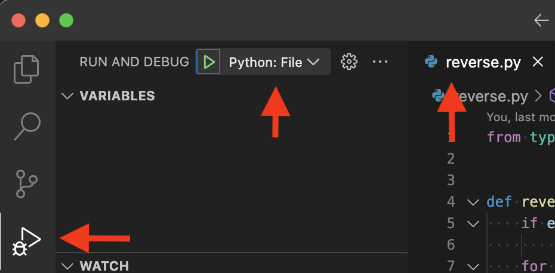
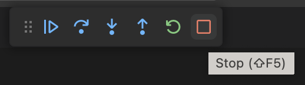
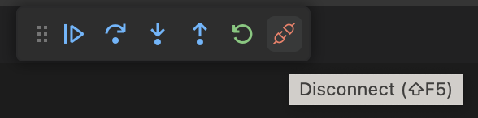

# Debugging with VS Code

A debugger is an incredibly powerful tool for developing software. It gives you visibility into the flow and state of your program as it is executing. It's also a great way of getting familiar with new code and building a mental model around it. 

VS Code provides a set of debugging tools that can be used across a wide range of languages. In these tutorials we'll be using python.

Pre-requisites:
- Get familiar with the basics on debugging with VS Code using these resources:
  - https://code.visualstudio.com/docs/editor/debugging
  - https://code.visualstudio.com/docs/introvideos/debugging
- Install the VS Code [Python extension](https://marketplace.visualstudio.com/items?itemName=ms-python.python)
- Clone the exercise materials: https://github.com/uw-ssec/vscode_debugging


## Basic debugging

- Open the `vscode_debugging` directory you cloned using VS Code
- Open `reverse.py` and review the code to get a basic understanding of what it does. Set up some break-points in the code, e.g. in line 17: `if s[i] == " ":`.
- Select the debugging tab on the left and the "Python File" debugging configuration from the drop down at the top.
- Press F5 (or click on the green "play" button) to start debugging
- Step through the code a few times to get comfortable with the basics, such as:
  - Breakpoints: normal, log points, conditional
  - Data inspection: variables, watch and callstack tabs.

<p align="center">

</p>

I highly recommend getting used to stepping through the code via function keys: `F5` (start/go), `F10` (step over) and `F11` (step into).

## Advanced debugging

### Unit testing

A very useful feature is being able to debug a unit test. This is easily done in VS Code by creating a launch configuration in `launch.json` to start the `pytest` module. An example one called `PyTest` is provided in the exercises repo. Try it out by selecting it from the RUN AND DEBUG drop down and hitting F5.

You'll note that this configuration specifies `tests.py` as the argument, but you can also specify a directory or any other argument that you can pass to `pytest`. For example, you can enable CLI logging and run a specific test by using the following arguments:

```
    "args": [
        "tests.py",
        "--log-cli-level=INFO",
        "-k", "test_reverse_words"
    ],
```
The logging statements will appear in the `Terminal` window with nice coloring.

### Jupyter notebooks

A small but very valuable feature is being able to debug into Jupyter notebooks when you run them in VS Code:

- Open `notebook.ipynb`
- Make sure you have a breakpoint in `reverse.py`
- Run the first cell 
- Start debugging the second cell by using the drop down on the left side:

<p align="center">
    
</p>

You'll notice the debugger will attach and your breakpoint in `reverse.py` should get hit. You can even set breakpoints in the cell code itself. 

One thing to be aware of is that when you stop debugging the notebook, the kernel will keep running. Unlike debugging a unit test or a file, where stopping the debugger stops the process. Notice the difference in the stop buttons:

<p align="center">
     <br/>
    
</p>

This can be very confusing if you change some code and start debugging again (assuming you are not using `%autoreload`)

### Pre-launch tasks
TODO:
See `tasks.json` and `Python: GenDate` configuration in `launch.json`

### Remote debugging
TODO:
See `Python: Attach using port` configuration in `launch.json` and `deleter.py`